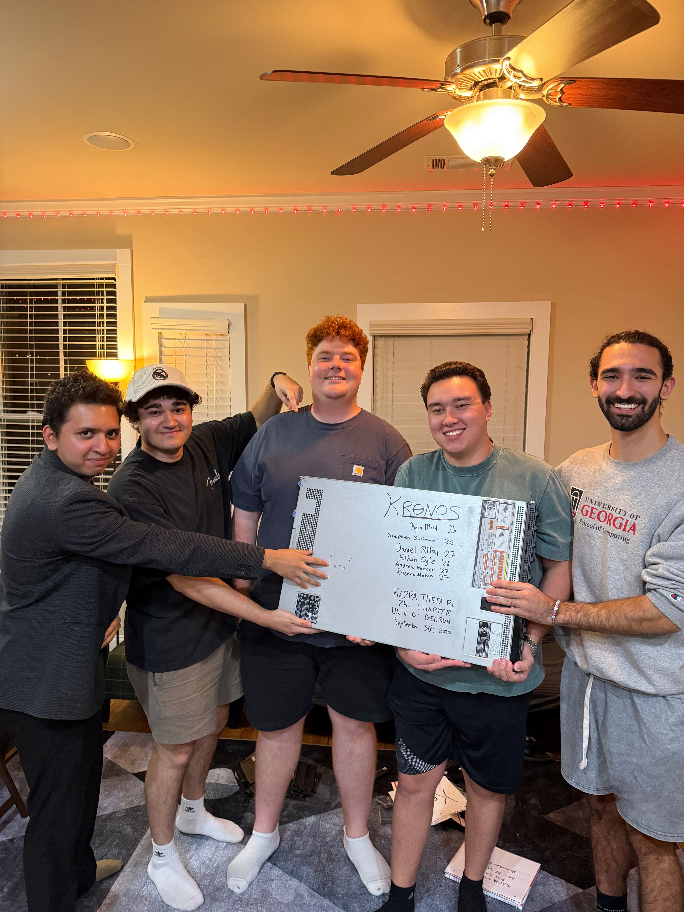

# Overview

Kronos is the dedicated Linux server powering the technological backbone of the **Phi Chapter of Kappa Theta Pi** at the University of Georgia.
It represents a milestone in UGA history: **no student organization before us has ever owned, operated, and maintained its own physical server infrastructure.**

This page provides a full overview of Kronos. Mainly: its purpose, capabilities, access methods, and current system layout.

---

## 🖥️ What is Kronos?

**Kronos** is a rack-mounted, enterprise-grade Linux server hosted in the **Cyber Wurx** data center in Atlanta, running:

- **Proxmox VE** as the primary hypervisor
- **LXC containers & virtual machines** for internal and external services
- **Dokploy** for automated deployments
- **Traefik** as the reverse proxy
- **Ubuntu Server 24.04 LTS** as base OS for many services

This is not a rented VPS. It's _real hardware_ owned, configured, secured, and maintained entirely by students.

---

## 🌐 Accessing Kronos

All infrastructure management is performed through our Proxmox interface:

### **➡️ [https://proxmox.ugaktp.com](https://proxmox.ugaktp.com)**

This authenticated management portal gives authorized engineers access to:

- VM lifecycle management
- LXC container administration
- Storage configuration
- Backups and snapshots
- Network configuration
- Metrics & monitoring

Access is restricted to authorized Tech + Infrastructure members.

---

## 🏗️ Current Infrastructure Layout

Below is the **current (live) VM and container layout** as deployed on Kronos.

### **Proxmox VE Cluster**

```
VE: Datacenter
└── VE kronos
```

### **Active Nodes (LXC / VM IDs)**

| ID  | Name      | Type          | Purpose                                                                           |
| --- | --------- | ------------- | --------------------------------------------------------------------------------- |
| 100 | traefik   | LXC Container | Reverse proxy for all services; entrypoint for apps                               |
| 101 | Ubuntu    | VM            | General-purpose Ubuntu VM (for experiments, testing, future services)             |
| 102 | immich    | LXC Container | Self-hosted media management for KTP (photos, events, archives)                   |
| 103 | authentik | LXC Container | Authentication, SSO provider, identity access management                          |
| 104 | KTP Docs  | LXC Container | Where this document lives!                                                        |
| 105 | hp2025    | LXC Container | Stephen used this for his [Hackprinceton](https://www.hackprinceton.com/) project |
| 106 | dokploy   | LXC Container | Deployment engine for internal + external apps (this site, etc.)                  |

## 🚀 Why Kronos Exists

Kappa Theta Pi is a fraternity built on innovation, engineering, and real-world impact.
Kronos gives our members _true infrastructure experience_ that cannot be simulated in classroom environments.

It enables:

### **Real Infrastructure & DevOps Experience**

Members learn:

- Linux administration
- Proxmox virtualization
- Docker & container orchestration
- Reverse proxying (Traefik)
- Networking & VLANs
- CI/CD deployment patterns
- Storage management
- Security hardening

### **Hosting for KTP Projects**

Kronos powers:

- Immich
- Chapter websites
- KTP Docs (docs.ugaktp.com)
- MyByte (points & attendance system)
- Internal automation
- Event systems (e.g., KTPHacks infrastructure)
- Research and experimentation environments

### **Long-term infrastructure**

Every VM, script, and service becomes part of a growing system future members inherit and build on.

---

## 🛡️ Security Philosophy

Kronos operates under strict, production-grade security principles:

- SSH key-only access
- Role-based permissions (Proxmox)
- Container isolation
- No unnecessary exposed ports
- Controlled networking access
- Password rotation
- Backups & snapshots
- Internal audit logs

Access is limited to Infrastructure Team members.

---

## 👥 Founding Infrastructure Team


**Class years listed as of the commissioning of Kronos:**

- **Ryan Majd ’26**
- **Stephen Sulimani ’25**
- **Daniel Rifai ’27**
- **Ethan Ogle ’26**
- **Andrew Warner ’27**
- **Krishna Mohan ’27**

This team physically installed, configured, secured, and delivered Kronos to Cyber Wurx signing the chassis to commemorate the achievement.

---

## 📸 Commissioning Ceremony

Kronos was officially commissioned on **September 30, 2025**, and ceremonially signed by the founding team before entering production in Atlanta.

_(Images provided above.)_

---

## 🌐 Vision for the Future

Planned expansions include:

- Monitoring stack (Grafana + Prometheus)
- Automated failover backups
- Dedicated KTP VPN
- Additional LXC clusters
- Kubernetes test cluster
- Zero-trust internal networking
- Dedicated API stack for MyByte + future chapter tools
- Full documentation at **docs.ugaktp.com**

Kronos is a living system (grows with the Chapter)

---

## 🏁 Final Note

Kronos is more than hardware.
It’s a symbol of what student engineers can accomplish when they’re given a challenge, freedom, and responsibility.

Built by students.
Powered by passion.
Maintained by the next generation of Kappa Theta Pi engineers.

---

TODO: Add these into the kronos directory under docs

- `kronos/access.md` (how to SSH, Proxmox roles, credentials guidance)
- `kronos/deployments.md` (Dokploy + Traefik deployment guide)
- `kronos/services.md` (full list of all containers + configs)
- `kronos/security.md` (exact security practices)
